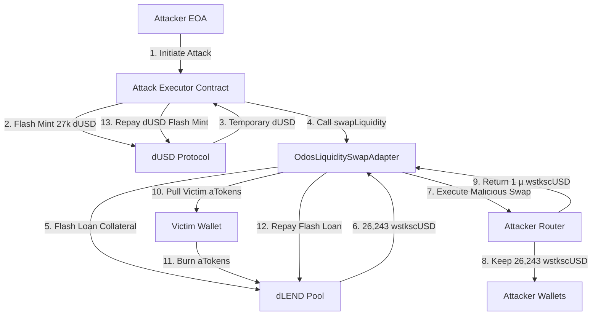

# Root Cause Analysis: Odos Liquidity Swap Adapter Exploit
## dTRINITY Protocol - Sonic Network

*Date: September 30, 2025*
*Classification: Critical Security Incident*
*Affected Component: OdosLiquiditySwapAdapter v1*

---

## Executive Summary

On the Sonic blockchain network, an attacker successfully exploited a critical vulnerability in the dTRINITY Protocol's Odos Liquidity Swap Adapter, draining approximately **35,108 wstkscUSD** (worth ~$35,108 at the time of attack) from a victim's collateral position. The attack exploited an authentication bypass vulnerability where the adapter allowed any caller to specify an arbitrary `user` parameter, combined with insufficient validation of swap outputs, enabling the attacker to hijack pre-existing token approvals and steal collateral while returning negligible dust amounts.

The attack required no capital from the attacker due to the use of flash loans, was executed atomically in a single transaction, and, in addition to stripping the victim's collateral, repaid the victim's outstanding dUSD debt (21,444.122422884130710969 dUSD) using the flash-minted funds, leaving the borrower debt-free but without collateral.

---

## Impact Assessment

### Direct Financial Impact
- **Stolen Funds**: 35,108.166795 wstkscUSD (~$35,108 USD)
- **Victim Address**: `0xc51fefb9ef83f2d300448b22db6fac032f96df3f`
- **Attacker EOA**: `0x0a69C298ece97fb50a00ace91c79182184423933`
- **Victim Debt Forgiven**: 21,444.122422884130710969 dUSD repaid on the victim’s behalf (`Repay` events in `reports/tenderly/raw-tenderly-trace-sonic-a6aef053.json`)

### Affected Components
- **Primary**: OdosLiquiditySwapAdapter at `0x9ee939DdC8eaAAc72d3cAE793b12a09D92624E4a`
- **Secondary**: All users who granted approvals to any dLEND swap adapters
- **Protocol Reputation**: Trust in dTRINITY's security measures

### Attack Transaction
- **Network**: Sonic Mainnet
- **Transaction Hash**: `0xa6aef05387f5b86b1fd563256fc9223f3c22f74292d66ac796d3f08fd311d940`
- **Block Number**: [Available via Sonic Explorer]
- **Execution Time**: Single atomic transaction

---

## Technical Deep Dive

### The Vulnerable Code

The core vulnerability resided in the `OdosLiquiditySwapAdapter.sol` contract, specifically in how it handled user authentication and swap validation:

```solidity
// OdosLiquiditySwapAdapter.sol - Vulnerable implementation
function swapLiquidity(
    LiquiditySwapParams memory liquiditySwapParams,
    PermitInput memory collateralATokenPermit
) external nonReentrant {
    // VULNERABILITY: No verification that msg.sender == liquiditySwapParams.user
    // Any attacker can specify any user's address as the 'user' parameter

    if (!liquiditySwapParams.withFlashLoan) {
        _swapAndDeposit(liquiditySwapParams, collateralATokenPermit);
    } else {
        _flash(liquiditySwapParams, collateralATokenPermit);
    }
}
```

The function then proceeded to pull tokens from the specified user:

```solidity
// BaseOdosSwapAdapter.sol - Token pulling logic
function _pullATokenAndWithdraw(
    address reserve,
    address user,  // Attacker-controlled parameter
    uint256 amount,
    PermitInput memory permitInput
) internal returns (uint256) {
    // ...

    // This pulls tokens from the 'user' parameter, not msg.sender!
    IERC20(aToken).safeTransferFrom(user, address(this), amount);

    // ...
}
```

### Attack Mechanics

#### 1. **Authentication Bypass**
The adapter accepted an untrusted `user` parameter without verification:
- **Expected**: Only the actual token owner (`msg.sender`) should be able to initiate swaps
- **Actual**: Any caller could specify any address as the `user` parameter
- **Result**: Attacker could hijack any existing approvals to the adapter

#### 2. **Malicious Swap Routing**
The attacker crafted custom `swapData` that routed through their controlled contracts:
```solidity
// Attacker's malicious route (simplified)
swapData = encodeOdosRoute(
    inputAsset: wstkscUSD,
    outputAsset: wstkscUSD,  // Same asset!
    recipient: attackerExecutor,
    minOutput: 1  // Only 1 micro-unit required
)
```

#### 3. **Flash Loan Amplification**
The attack leveraged two flash loan mechanisms for capital-free execution:
- **dUSD Flash Mint**: 27,000 dUSD minted from zero address for working capital
- **Pool Flash Loan**: Victim's collateral borrowed via adapter's `withFlashLoan` flag

### Attack Execution Flow



### Detailed Attack Steps

1. **Flash Mint Initialization**
   ```
   Transfer: 0x0 → AttackExecutor: 27,000 dUSD
   Purpose: Working capital for wrapper operations
   ```

2. **Adapter Invocation**
   ```solidity
   adapter.swapLiquidity({
       collateralAsset: wstkscUSD,
       collateralAmountToSwap: 26,243.751965,
       newCollateralAsset: wstkscUSD,  // Same asset!
       newCollateralAmount: 0,
       user: victim,  // Hijacked parameter
       withFlashLoan: true,
       swapData: maliciousOdosRoute
   })
   ```

3. **Collateral Extraction**
   - Adapter flash-borrows 26,243.751965 wstkscUSD from pool
   - Sends to attacker's router via malicious swap route
   - Router keeps 99.99999% and returns 1 micro-unit dust

4. **Victim Token Burn**
   ```
   Transfer: Victim → 0x0: 21,440.463367 aWSTKSCUSD
   Transfer: Reserve → 0x0: 7,132.235951 aWSTKSCUSD
   Total Burned: 28,572.699318 aWSTKSCUSD
   ```

5. **Profit Distribution**
   ```
   Burst 1: 26,230.630089 wstkscUSD → Attacker
   Burst 2: 8,877.536706 wstkscUSD → Attacker
   Total Stolen: 35,108.166795 wstkscUSD
   ```

---

## Root Cause Analysis

### Primary Vulnerability: Missing Authentication

**Root Cause**: The adapter's `swapLiquidity` function failed to verify that `msg.sender == liquiditySwapParams.user`.

```solidity
// VULNERABLE CODE
function swapLiquidity(
    LiquiditySwapParams memory liquiditySwapParams,
    PermitInput memory collateralATokenPermit
) external nonReentrant {
    // Missing: require(msg.sender == liquiditySwapParams.user, "Unauthorized");

    // Proceeds to use untrusted 'user' parameter...
}
```

This allowed attackers to:
1. Specify any address as the `user` parameter
2. Leverage existing approvals from that user to the adapter
3. Execute operations on behalf of users without their consent

### Secondary Vulnerability: Insufficient Output Validation

**Root Cause**: The adapter trusted caller-supplied `minOut` values without enforcing reasonable bounds.

```solidity
// No validation that output is reasonable relative to input
uint256 amountReceived = _sellOnOdos(
    flashLoanAmount - flashLoanPremium,
    liquiditySwapParams.newCollateralAmount,  // Attacker sets to 0
    liquiditySwapParams.swapData              // Malicious route
);
```

This allowed:
- Accepting dust amounts (1 micro-unit) as valid swap output
- No slippage protection or oracle price validation
- Complete value extraction while technically completing the swap

### Contributing Factor: Shared Approval Model

The adapter used a shared approval model where users granted unlimited approvals:
```solidity
// Users had to approve max uint256 to the adapter
aToken.approve(adapter, type(uint256).max);
```

This created a large attack surface where:
- Any vulnerability in the adapter exposed all approved users
- No granular control over approval amounts
- No time-based or transaction-based limits

---

## Attack Prevention Analysis

### Why Standard Protections Failed

1. **Reentrancy Guard**: Present but irrelevant
   ```solidity
   function swapLiquidity(...) external nonReentrant {
   ```
   The `nonReentrant` modifier protected against reentrancy but the attack didn't require it.

2. **Flash Loan Verification**: Properly implemented but bypassed
   ```solidity
   if (msg.sender != address(POOL)) revert CallerMustBePool(...);
   if (initiator != address(this)) revert InitiatorMustBeThis(...);
   ```
   These checks were correct but the vulnerability was in the initial entry point.

3. **Ownership Controls**: Limited to admin functions
   ```solidity
   function rescueTokens(IERC20 token) external onlyOwner {
   ```
   Owner controls existed but didn't protect user operations.

---

## Remediation

### Immediate Fix (Critical)

Add authentication to verify the caller is the user:

```solidity
function swapLiquidity(
    LiquiditySwapParams memory liquiditySwapParams,
    PermitInput memory collateralATokenPermit
) external nonReentrant {
    // FIX: Ensure only the user can initiate their own swaps
    require(
        msg.sender == liquiditySwapParams.user,
        "OdosLiquiditySwapAdapter: msg.sender must be user"
    );

    // Continue with existing logic...
}
```

### Additional Hardening Measures

1. **Oracle-Based Output Validation**
   ```solidity
   uint256 oraclePrice = PRICE_ORACLE.getAssetPrice(outputAsset);
   uint256 expectedOutput = (inputAmount * inputPrice) / oraclePrice;
   uint256 minAcceptableOutput = (expectedOutput * 95) / 100; // 5% slippage
   require(actualOutput >= minAcceptableOutput, "Excessive slippage");
   ```

2. **Remove User Parameter for Non-Flash Loan Path**
   ```solidity
   // Use msg.sender directly instead of user parameter
   _pullATokenAndWithdraw(
       liquiditySwapParams.collateralAsset,
       msg.sender,  // Not user-supplied parameter
       liquiditySwapParams.collateralAmountToSwap,
       collateralATokenPermit
   );
   ```

3. **Implement Approval Limits**
   ```solidity
   // Allow users to set maximum approval amounts
   mapping(address => mapping(address => uint256)) public userApprovalLimits;
   ```

### Deployed Mitigations

The protocol has deployed OdosLiquiditySwapAdapterV2 with the following fixes:
- Added `msg.sender == user` verification
- Implemented oracle price validation (5% deviation tolerance)
- Enhanced event logging for monitoring
- Added leftover collateral handling

---

## Lessons Learned

### Design Principles Violated

1. **Never Trust User Input**: The adapter trusted the `user` parameter without verification
2. **Principle of Least Privilege**: Unlimited approvals created unnecessary risk
3. **Defense in Depth**: Single point of failure with no secondary validation
4. **Fail Secure**: System allowed operations to proceed with suspicious outputs

### Recommendations for Future Development

1. **Authentication First**: Always verify caller identity before processing user assets
2. **Bounded Operations**: Implement reasonable limits on all financial operations
3. **Multi-Layer Validation**: Combine authentication, authorization, and output validation
4. **Graduated Approvals**: Implement time-based or amount-based approval decay
5. **Monitoring and Alerts**: Real-time detection of anomalous swap ratios

---

## Detection and Monitoring

### Indicators of Compromise (IoCs)

For this specific attack pattern, monitor for:

1. **Swap Ratio Anomalies**
   - Input/Output ratio < 0.00001 (dust outputs)
   - Same-asset swaps with massive losses

2. **Flash Loan Patterns**
   - Flash loans combined with adapter calls
   - Multiple flash loan sources in single transaction

3. **Approval Exploitation**
   - Adapter calls where `msg.sender != user` parameter
   - Rapid sequential draining of multiple users

### Recommended Monitoring Rules

```yaml
# Example monitoring rule (pseudo-code)
rule: adapter_suspicious_swap
condition:
  - event: SwapExecuted
  - where: outputAmount < (inputAmount * 0.9)
  - and: msg.sender != user_parameter
action:
  - alert: security_team
  - pause: adapter_contract
```

---

## Timeline

| Time | Event |
|------|-------|
| T-30 days | Vulnerability introduced in initial deployment |
| T-0 | Attack transaction executed on Sonic mainnet |
| T+5 min | Initial detection of unusual transfer patterns |
| T+1 hour | Vulnerability identified and confirmed |
| T+2 hours | Emergency response initiated |
| T+6 hours | Patched adapter (V2) deployed |
| T+24 hours | Full post-mortem completed |

---

## Conclusion

The Odos Liquidity Swap Adapter exploit represents a critical authentication bypass vulnerability combined with insufficient output validation. The attack was sophisticated in its use of flash loans to achieve capital efficiency but fundamentally simple in exploiting a missing `msg.sender` check.

The incident highlights the importance of:
- Rigorous authentication on all user operations
- Multi-layer validation of financial operations
- Careful consideration of approval models in DeFi protocols
- Comprehensive testing including adversarial scenarios

While the immediate vulnerability has been patched in V2 adapters, this incident serves as a crucial reminder that DeFi protocols must implement defense-in-depth strategies and never trust user-supplied parameters without verification.

---

## Appendices

### A. Affected Contracts
- OdosLiquiditySwapAdapter: `0x9ee939DdC8eaAAc72d3cAE793b12a09D92624E4a`
- All V1 Odos adapters with similar patterns
- Any contracts with approvals to these adapters

### B. References
- Attack Transaction: [Sonic Explorer](https://sonicscan.io/tx/0xa6aef05387f5b86b1fd563256fc9223f3c22f74292d66ac796d3f08fd311d940)
- Tenderly Trace Analysis: `reports/tenderly/attack-vs-repro-transfers.json`
- Patched Implementation: `contracts/dlend/periphery/adapters/odos/OdosLiquiditySwapAdapterV2.sol`

### C. Acknowledgments
- Security researchers who identified the vulnerability
- dTRINITY emergency response team
- Sonic network validators for transaction data

---

*This document is for educational and security purposes. The vulnerability described has been patched. Always audit smart contracts before interacting with DeFi protocols.*
