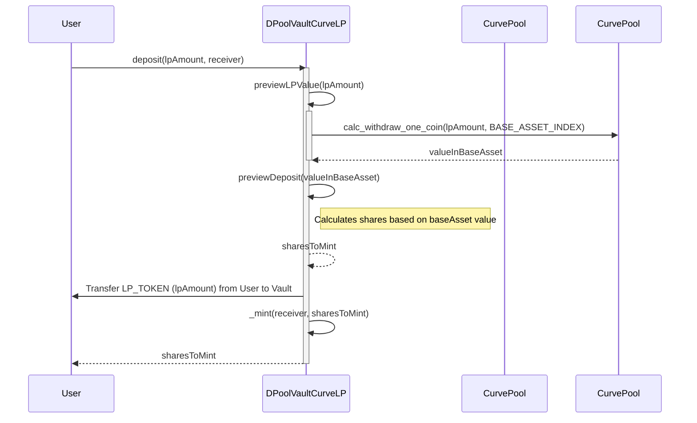
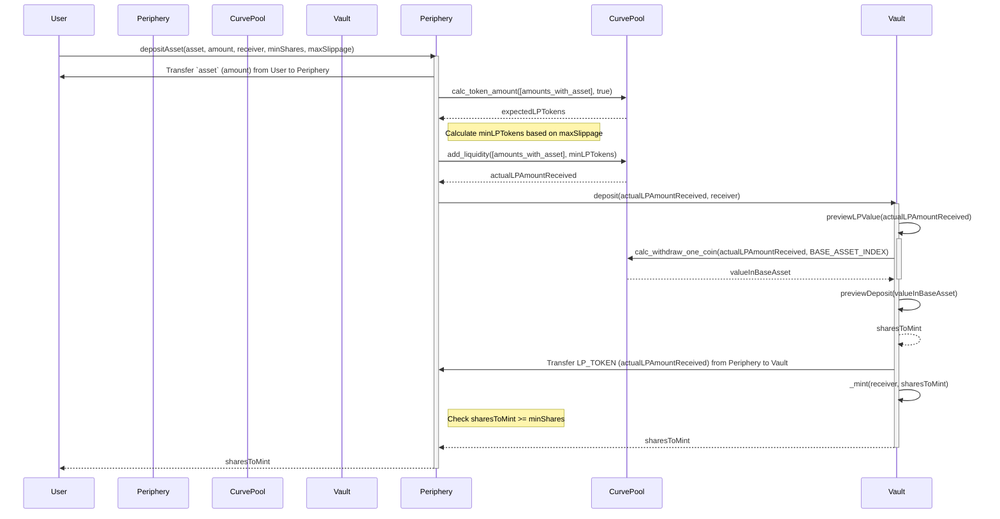
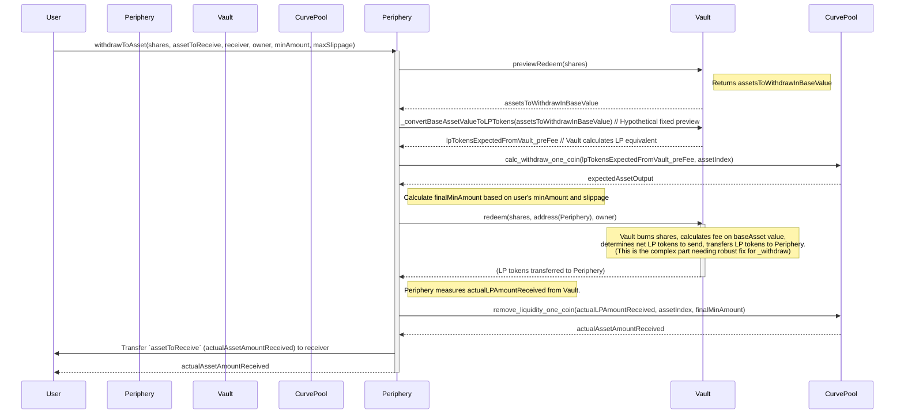

# Audit

## System Overview: dPOOL

The `dPOOL` system aims to provide users with access to yield farming opportunities by creating individual, isolated vaults for specific LP (Liquidity Provider) positions on various DEXs. The core idea is to use ERC4626-compliant vaults that accept LP tokens directly but are valued in a consistent `baseAsset` (e.g., USDC) using the respective DEX's native pricing mechanisms. This avoids reliance on external oracles for LP valuation within the vault.

The system is designed with a separation of concerns:

1.  **`DPoolVaultLP.sol` (Abstract Base Vault):**
    *   An abstract ERC4626 contract. It's initialized with a `baseAsset` for valuation purposes.
    *   It directly accepts and holds a specific `LP_TOKEN`.
    *   Shares are minted/burned based on the value of deposited/withdrawn LP tokens, expressed in the `baseAsset`.
    *   Includes a withdrawal fee mechanism, managed by `FEE_MANAGER_ROLE`.
    *   Requires derived contracts to implement LP valuation (`previewLPValue`) and pool identification (`pool`).

2.  **`DPoolVaultCurveLP.sol` (Curve Implementation):**
    *   A concrete implementation of `DPoolVaultLP` for Curve Finance LP tokens.
    *   It uses Curve's `calc_withdraw_one_coin` function to determine the value of the Curve LP tokens in the specified `baseAsset`.
    *   The `baseAsset` must be one of the coins in the Curve pool.

3.  **`DPoolCurvePeriphery.sol` (Curve DEX Handler):**
    *   A periphery contract that facilitates user interaction with `DPoolVaultCurveLP` using the underlying assets of a Curve pool (e.g., USDC, DAI) instead of LP tokens directly.
    *   It handles the conversion of whitelisted pool assets to Curve LP tokens (via `add_liquidity`) and deposits them into the vault.
    *   It also handles withdrawals from the vault, converting the received LP tokens back into a whitelisted pool asset (via `remove_liquidity_one_coin`).
    *   Provides slippage protection for DEX interactions.
    *   Asset whitelisting and maximum slippage are managed by an admin role.

**Key Design Principles:**
*   **Direct LP Handling in Vault:** Vaults manage LP tokens.
*   **Base Asset Valuation:** Share price is based on `baseAsset` value of LPs.
*   **DEX-Native Pricing:** Relies on DEX's internal price calculations.
*   **Periphery for Asset Conversion:** Simplifies user interaction for those not holding LPs.
*   **Risk Isolation:** Each vault is independent.
*   **Immutability:** Core parameters like LP token, pool addresses are immutable.
*   **Access Control:** Uses OpenZeppelin's `AccessControl` for admin functions.

## Audit Findings

I've identified several areas of concern, primarily related to the interaction between the ERC4626 `baseAsset` valuation and the physical handling of `LP_TOKEN`.

### Critical Vulnerabilities:

None identified that would lead to immediate, direct theft with standard user interaction, assuming admin roles are secure. However, the logical flaws below can lead to incorrect accounting, potentially loss of user funds or unfair distribution of assets.

### High Severity Issues:

1.  **Incorrect Share Calculation in `DPoolVaultLP.deposit`:**
    *   **Description:** The `deposit(uint256 assets, ...)` function in `DPoolVaultLP` takes `assets` as the amount of `LP_TOKEN` to deposit. However, it calculates shares using `shares = previewDeposit(assets)`. The `previewDeposit` function (from ERC4626) expects its argument to be an amount of the vault's `asset()` (which is `baseAsset`). This mixes units: `lpAmount` is used where `baseAsset` value is expected, leading to an incorrect number of shares being minted.
    *   **Impact:** Users will receive an incorrect amount of shares, disproportionate to the actual value they deposited. This breaks the fundamental accounting of the vault.
    *   **Recommendation:**
        Modify `DPoolVaultLP.deposit` to correctly calculate shares:
        ```solidity
        // In DPoolVaultLP.sol
        function deposit(
            uint256 lpAmount, // Parameter renamed for clarity
            address receiver
        ) public virtual override(ERC4626, IERC4626) nonReentrant returns (uint256 shares) {
            // maxDeposit check might also need to consider the lpAmount vs baseAsset value limits
            require(lpAmount <= maxDeposit(receiver), "ERC4626: deposit more than max"); 

            uint256 valueInBaseAsset = previewLPValue(lpAmount); // Get value of LP_TOKEN in baseAsset terms
            shares = previewDeposit(valueInBaseAsset); // Calculate shares based on the baseAsset value

            _deposit(_msgSender(), receiver, lpAmount, shares); // _deposit correctly handles lpAmount of LP_TOKEN

            return shares;
        }
        ```
        The `maxDeposit` function in ERC4626 also operates in terms of `asset()` (i.e. `baseAsset`). Ensure this check is also meaningful. It might be better to check `valueInBaseAsset <= maxDeposit(receiver)`.

2.  **Incorrect LP Token Calculation and Transfer in `DPoolVaultLP._withdraw`:**
    *   **Description:** The `_withdraw(..., uint256 assets, ...)` function receives `assets` as the value the user wants to withdraw, expressed in `baseAsset`. A fee is calculated on this `baseAsset` value. The critical flaw is `uint256 lpTokensToSend = assets - fee;`. This line subtracts two `baseAsset` values and then treats the result (`lpTokensToSend`) as if it were an amount of `LP_TOKEN` to transfer to the user.
    *   **Impact:** The vault will send an amount of `LP_TOKEN` that is numerically equal to a `baseAsset` value, not the actual equivalent amount of LP tokens. This will almost certainly result in users receiving a vastly incorrect amount of LP tokens (likely far too many if LP token price > base asset, or too few otherwise), leading to significant loss for users or the vault.
    *   **Recommendation:**
        The `_withdraw` function needs to convert the net `baseAsset` value (after fees) into the corresponding amount of `LP_TOKEN`s.
        ```solidity
        // In DPoolVaultLP.sol (conceptual change)
        function _withdraw(
            address caller,
            address receiver,
            address owner,
            uint256 assetsToWithdrawInBaseValue, // This is the value in baseAsset
            uint256 sharesToBurn
        ) internal virtual override {
            if (caller != owner) {
                _spendAllowance(owner, caller, sharesToBurn);
            }

            _burn(owner, sharesToBurn); // Burn shares first

            uint256 feeInBaseValue = (assetsToWithdrawInBaseValue * withdrawalFeeBps) /
                BasisPointConstants.ONE_HUNDRED_PERCENT_BPS;
            uint256 netValueToDistributeInBaseAsset = assetsToWithdrawInBaseValue - feeInBaseValue;

            // This function needs to be implemented by derived contracts (e.g., DPoolVaultCurveLP)
            uint256 lpTokensToActuallySend = _convertBaseAssetValueToLPTokens(netValueToDistributeInBaseAsset);

            uint256 currentLpBalance = IERC20(LP_TOKEN).balanceOf(address(this));
            if (currentLpBalance < lpTokensToActuallySend) {
                revert InsufficientLPTokens(); // Ensure enough LP tokens exist
            }

            IERC20(LP_TOKEN).safeTransfer(receiver, lpTokensToActuallySend);

            emit Withdraw(caller, receiver, owner, assetsToWithdrawInBaseValue, sharesToBurn);
        }

        // Abstract function to be implemented in derived contracts
        function _convertBaseAssetValueToLPTokens(
            uint256 baseAssetValue
        ) internal view virtual returns (uint256 lpAmount);
        ```
        `DPoolVaultCurveLP` would then need to implement `_convertBaseAssetValueToLPTokens`. This is non-trivial for Curve. It's the inverse of `calc_withdraw_one_coin`. You might need to use `calc_token_amount` by trying to figure out the input `amounts` array that would result in the desired `baseAssetValue` when adding liquidity *from* the `baseAsset` alone, or use iterative methods (binary search on LP amount using `previewLPValue`). This complexity needs careful consideration.

3.  **Incorrect Usage of Vault Values in `DPoolCurvePeriphery.withdrawToAsset`:**
    *   **Description:**
        1.  `lpAmount = VAULT.previewRedeem(shares);`: `VAULT.previewRedeem` (which is `convertToAssets` from ERC4626) returns the value of `shares` in terms of `VAULT.asset()` (i.e., `baseAsset`). So, `lpAmount` here is actually a `baseAsset` value, not an LP token amount.
        2.  `expectedAsset = POOL.calc_withdraw_one_coin(lpAmount, int128(uint128(assetIndex)))`: This line then incorrectly uses this `baseAsset` value (`lpAmount`) as the first argument to Curve's `calc_withdraw_one_coin`, which expects an amount of Curve LP tokens.
        3.  A similar issue occurs with `actualLPAmount = VAULT.redeem(shares, address(this), owner);`. If `VAULT.redeem` calls the flawed `_withdraw` logic, `actualLPAmount` will be a `baseAsset` value, not an actual LP amount. This incorrect value is then passed to `POOL.remove_liquidity_one_coin`.
    *   **Impact:** The periphery contract will request withdrawal of an incorrect amount of assets from the Curve pool due to providing wrong input (base asset value instead of LP token amount) to `calc_withdraw_one_coin` and `remove_liquidity_one_coin`. This will lead to transaction failures or incorrect amounts withdrawn for the user.
    *   **Recommendation:**
        The periphery needs to obtain the correct LP token amount from the vault.
        If `DPoolVaultLP._withdraw` and related functions are fixed to correctly handle LP token amounts based on `baseAsset` value withdrawals (as per finding #2), then `VAULT.redeem` should return the correct *`baseAsset` value* that was redeemed. The periphery then needs to:
        a. Call `VAULT.redeem(shares, address(this), owner)` to burn shares and have the periphery receive the *actual LP tokens*. This requires `_withdraw` to be fixed to send LP tokens.
        b. The `redeem` function from ERC4626, if not overridden to return LP tokens, returns the `baseAsset` amount. The periphery needs the actual LP tokens.
        The interaction needs to be:
        ```solidity
        // In DPoolCurvePeriphery.withdrawToAsset
        // 1. Get the number of LP tokens the vault will send for these shares (after its internal fees)
        // This requires a new preview function in the vault, e.g., previewRedeemToLP(shares)
        // uint256 lpAmountToReceiveFromVault = VAULT.previewRedeemToLP(shares); // hypothetical

        // For now, assuming VAULT.redeem is fixed to send LP tokens to address(this)
        // and returns the amount of LP tokens it *should* have sent based on shares (before its own fee)
        // This is getting complicated due to vault's internal fee.

        // Simpler: Periphery should work with shares.
        // It tells the vault to send LP tokens for 'shares' to the periphery contract.
        // VAULT.redeem(shares, address(this), owner); // This call should ensure periphery gets the LP tokens.
        // The amount of LP tokens received needs to be tracked.
        // How many LP tokens does 'shares' represent?
        uint256 lpTokensForShares = VAULT.previewWithdrawLP(VAULT.previewRedeem(shares)); // If previewWithdrawLP is fixed (see #4)

        // Then use lpTokensForShares with Curve, applying slippage.
        uint256 expectedAsset = POOL.calc_withdraw_one_coin(lpTokensForShares, ...);
        // ... calculate minAssetFromSlippage ...

        // Perform the actual redeem from vault to periphery
        IERC20(VAULT.lpToken()).approve(address(VAULT), lpTokensForShares); // This is tricky; vault should pull shares
                                                                        // using its allowance from owner
        
        // The VAULT.redeem function is called by the periphery on behalf of the owner.
        // It should transfer the corresponding LP tokens to address(this) (the periphery).
        // The amount of LP tokens transferred is the key.
        // Let's assume `_withdraw` is fixed. `VAULT.redeem` would trigger LP transfer.

        // After VAULT.redeem(shares, address(this), owner) has successfully transferred LP tokens to the periphery:
        uint256 actualLPAmountReceived = IERC20(VAULT.lpToken()).balanceOf(address(this)) - initialLpBalanceBeforeRedeem; // Measure it

        assetAmount = POOL.remove_liquidity_one_coin(
            actualLPAmountReceived, // Use the actual LP tokens received by periphery
            int128(uint128(assetIndex)),
            finalMinAmount
        );
        ```
        This entire flow in `DPoolCurvePeriphery.withdrawToAsset` needs to be re-architected carefully based on how `DPoolVaultLP`'s withdrawal logic is fixed. The periphery must receive actual LP tokens from the vault and then use that amount with Curve.

4.  **Incorrect `DPoolVaultLP.previewWithdrawLP` Implementation:**
    *   **Description:** The interface `IDPoolVaultLP.previewWithdrawLP(uint256 assets)` states it should return `lpAmount` (amount of LP tokens) for a given `assets` (amount of `baseAsset`). However, the implementation in `DPoolVaultLP` is `return previewWithdraw(assets);`. The ERC4626 `previewWithdraw(assets)` function returns the number of *shares* that would be burned for that amount of `baseAsset`.
    *   **Impact:** Any off-chain or on-chain component relying on `previewWithdrawLP` to get an estimate of LP tokens will receive an incorrect value (shares instead of LP amount).
    *   **Recommendation:**
        `previewWithdrawLP` should correctly calculate the amount of LP tokens corresponding to the `baseAsset` value. This also depends on the fix for finding #2 (the `_convertBaseAssetValueToLPTokens` logic).
        ```solidity
        // In DPoolVaultLP.sol
        function previewWithdrawLP(
            uint256 assetsInBaseValue
        ) external view override returns (uint256 lpAmount) {
            // This assumes _convertBaseAssetValueToLPTokens does not account for fees.
            // If it does, the naming should be clear or fee logic separated.
            // For a preview, it's typically pre-fee.
            return _convertBaseAssetValueToLPTokens(assetsInBaseValue);
        }
        ```

### Medium Severity Issues:

1.  **Admin Power and Centralization Risk:**
    *   **Description:** The `DEFAULT_ADMIN_ROLE` on `DPoolCurvePeriphery` can whitelist/remove assets and set `maxSlippageBps`. The `FEE_MANAGER_ROLE` on `DPoolVaultLP` (likely the same admin) can set `withdrawalFeeBps`.
    *   **Impact:** A compromised or malicious admin could disrupt operations, set unfavorable fees/slippage, or restrict asset usage (though `addWhitelistedAsset` correctly checks if the asset is part of the Curve pool).
    *   **Recommendation:** Secure admin keys using a multi-signature wallet. Consider a TimeLock contract for critical changes like fee adjustments or changes to fundamental parameters (if any were mutable).

2.  **Reliance on Curve Pool Correctness and Price Stability:**
    *   **Description:** The entire valuation of LP tokens (and thus share price) in `DPoolVaultCurveLP` relies on Curve's `calc_withdraw_one_coin`. The periphery also relies on Curve's `add_liquidity`, `remove_liquidity_one_coin`, and `calc_token_amount`.
    *   **Impact:** Any vulnerability, bug, or economic exploit within the specific Curve pool used could directly impact the vault's `totalAssets` and share pricing, potentially leading to loss of value. Short-term price manipulations on the Curve pool could also be exploited during deposits/withdrawals if not mitigated by sufficient liquidity or user-set slippage.
    *   **Recommendation:** This is an accepted risk as per the design ("DEX-native pricing"). Ensure that only reputable and highly liquid Curve pools are used. Users should be aware of the inherent risks of AMM price fluctuations and set appropriate slippage.

### Low Severity Issues / Informational:

1.  **ERC4626 First Depositor / Precision:**
    *   **Description:** ERC4626 vaults can sometimes have issues with the very first depositor or when total assets are very low, leading to potential precision loss or donation of assets if not handled carefully. OpenZeppelin's implementation is generally robust.
    *   **Recommendation:** While OZ's implementation is good, be aware of potential minor dust amounts or slight advantages/disadvantages for the first few depositors, especially if `previewLPValue` can return 0 for non-zero LP amounts in extreme edge cases of the Curve pool. Consider initializing the vault with a tiny amount of liquidity by the deployer if this becomes a concern.

2.  **Gas Cost for `removeWhitelistedAsset`:**
    *   **Description:** The removal of an asset from `supportedAssets` array in `DPoolCurvePeriphery` involves a loop.
    *   **Impact:** For a small number of assets (typically 2 for a Curve pool), this is negligible. If it could somehow support a large number, gas costs could rise.
    *   **Recommendation:** The current implementation (swap with last and pop) is efficient. This is not a concern given `poolAssets` is fixed at 2.

3.  **No Event for `DEFAULT_ADMIN_ROLE` Grant in Constructor:**
    *   **Description:** The `DPoolCurvePeriphery` and `DPoolVaultLP` constructors grant `DEFAULT_ADMIN_ROLE` but only emit `RoleGranted` events implicitly if `_grantRole` does. It's good practice if the design intends for this to be tracked. OpenZeppelin's `_grantRole` emits `RoleGranted`.
    *   **Recommendation:** This is generally fine as OZ handles it.

### General Recommendations & Best Practices:

*   **Comprehensive Test Coverage:** Crucially, test all identified fixes thoroughly, especially edge cases in the Curve interactions, fee calculations, and the `deposit`/`withdraw` logic with the proposed changes. Test with different `baseAsset` and `LP_TOKEN` decimal counts.
*   **Multi-Sig for Admin Roles:** Re-iterate the importance of using multi-signature wallets for all admin and fee management roles.
*   **Monitoring:** Monitor vault `totalAssets`, share price, and Curve pool health for any anomalies.
*   **Consider `_convertBaseAssetValueToLPTokens` Implementation carefully:** The feasibility and gas cost of accurately converting a `baseAsset` value back to an LP token amount for Curve pools is key to fixing the withdrawal logic. If a direct calculation isn't available from Curve, an iterative approach (binary search) might be needed, which can be complex and costly.
    *   An alternative for fees: If the withdrawal fee was a percentage of the *shares* being burned (and these shares were transferred to a fee address), or if the fee was taken from the redeemed LP tokens *before* conversion from `baseAsset` value, it might simplify the accounting. However, this changes the fee structure from being denominated in `baseAsset`.

## Business Logic Review

The core business logic is to provide a yield-bearing vault for LP tokens, valued in a stable `baseAsset`. The separation of the vault (LP handling) and periphery (asset conversion) is a good design pattern.

The main flaw, as detailed above, is in the incorrect translation between `LP_TOKEN` amounts and their `baseAsset` values during the deposit's share calculation and especially during withdrawal's LP payout calculation and fee application. This makes the current implementation's "business logic" for value accrual and distribution fundamentally incorrect.

Once the accounting issues are resolved, the logic of users depositing assets/LPs and earning yield (implicitly through the appreciation of LP tokens, which then reflects in `totalAssets` and thus share price) should work as intended for an ERC4626 vault. The withdrawal fee is a straightforward percentage fee.

## MermaidJS Sequence Diagrams

Here are sequence diagrams for the intended user flows (assuming the fixes are in place for correct value conversions).

**1. Direct LP Deposit to `DPoolVaultCurveLP` (Advanced Users)**



**2. Asset Deposit via `DPoolCurvePeriphery` (Regular Users)**



**3. Asset Withdrawal via `DPoolCurvePeriphery` (Illustrating Post-Fix Complexity)**
*(This diagram assumes fixes are implemented, especially the challenging LP token amount calculation for withdrawal from the vault)*



This withdrawal diagram highlights the need for the vault to correctly dispense LP tokens and for the periphery to correctly use them.

## Conclusion

The `dPOOL` system has a sound architectural idea with its separation of concerns and use of ERC4626. However, the identified logical flaws in handling `baseAsset` valuation versus `LP_TOKEN` transfers are critical and need to be addressed to ensure correct accounting and prevent loss of funds. The most challenging fix will be the `_convertBaseAssetValueToLPTokens` logic required for withdrawals from `DPoolVaultLP`, especially for the Curve implementation. Careful re-design and thorough testing of these core mechanics are paramount.


# Ticket

## Refactoring Ticket: DPool Vault Asset Model Correction

**Ticket ID:** DPOOL-REFACTOR-001
**Title:** Correct DPool Vault Asset Model to use LP Token as Primary Asset
**Date:** 2024-03-26
**Reporter:** AI Assistant
**Assignee:** Dev Team

**1. Summary:**

The current implementation and parts of the design document for `DPoolVaultLP` and `DPoolVaultCurveLP` incorrectly assume that the vault's internal accounting and ERC4626 `asset()` are a `baseAsset` (e.g., USDC), while the vault physically holds `LP_TOKEN`. This has led to complex and potentially flawed valuation logic within the vault.

This refactor will correct the design and implementation so that:
*   `DPoolVaultLP` (and its derivatives like `DPoolVaultCurveLP`) use the **`LP_TOKEN` as their primary `asset()`** for all ERC4626 purposes.
*   All internal accounting, share calculations, deposits, and withdrawals in the vault are denominated directly in units of the `LP_TOKEN`.
*   The concept of a `baseAsset` within `DPoolVaultCurveLP` will be used *solely* for the auxiliary view function `previewLPValue` (to provide an *external* valuation of LP tokens in terms of another asset, e.g., USDC) and will not affect the core ERC4626 mechanics.
*   The `DPoolCurvePeriphery` contract will remain responsible for converting user-friendly assets (e.g., USDC, frxUSD) to/from `LP_TOKEN`s before interacting with the vault.

**2. Motivation:**

*   **Correctness:** Aligns the vault with standard ERC4626 behavior, where `asset()` is the token the vault manages.
*   **Simplicity:** Drastically simplifies the vault's internal logic, removing the need for complex LP valuation for share calculation.
*   **Robustness:** Reduces the surface area for errors related to misinterpreting `LP_TOKEN` amounts versus `baseAsset` values.
*   **Clarity:** Makes the vault's role clear and distinct from the periphery's conversion role.

**3. Scope of Changes:**

**3.1. Contracts:**

*   **`DPoolVaultLP.sol`:**
    *   **Constructor:** The `baseAsset` parameter should be renamed or clarified that `ERC4626(IERC20(lpToken))` should be called. The `asset()` function inherited from ERC4626 will now implicitly refer to `LP_TOKEN`.
    *   **`asset()`:** Ensure it correctly returns `LP_TOKEN` (this is handled by ERC4626 constructor).
    *   **`totalAssets()`:** This function (if overridden) **MUST** return `IERC20(LP_TOKEN).balanceOf(address(this))`. The abstract nature might be removable if this is the only implementation.
    *   **`deposit(uint256 assets, ...)`:** The `assets` parameter will now directly mean "amount of `LP_TOKEN`". The call `previewDeposit(assets)` will correctly calculate shares based on `LP_TOKEN` amounts.
    *   **`withdraw(uint256 assets, ...)`:** The `assets` parameter will now directly mean "amount of `LP_TOKEN`".
    *   **`_deposit(...)`:** The `assets` parameter is amount of `LP_TOKEN`. Logic is largely correct.
    *   **`_withdraw(...)`:** The `assets` parameter is amount of `LP_TOKEN`. The `fee` should be calculated as a percentage of this `LP_TOKEN` amount. `lpTokensToSend = assets - fee` becomes correct.
    *   **`previewLPValue(uint256 lpAmount)`:** This function's purpose (valuing LP in a *different, external* base asset) remains but must be clearly documented as auxiliary and not used in core ERC4626 math. This implies the vault might still need to know about an *external* `baseAsset` for this specific view function only.
    *   **`FEE_MANAGER_ROLE` and `withdrawalFeeBps`:** Fees will be a percentage of `LP_TOKEN`s withdrawn.

*   **`DPoolVaultCurveLP.sol`:**
    *   **Constructor:**
        *   Change `ERC4626(IERC20(baseAsset))` to `ERC4626(IERC20(_lpToken))`.
        *   The `baseAsset` parameter is now *only* for `previewLPValue`.
        *   The `BASE_ASSET_INDEX` is now *only* for `previewLPValue`.
    *   **`totalAssets()`:** This **MUST** be implemented as `return IERC20(LP_TOKEN).balanceOf(address(this));`. The previous logic using `calc_withdraw_one_coin` for `totalAssets` is incorrect under the new model.
    *   **`previewLPValue(uint256 lpAmount)`:** This function retains its logic using `calc_withdraw_one_coin` and `BASE_ASSET_INDEX` to provide the valuation of `lpAmount` (of `LP_TOKEN`) in terms of the externally specified `baseAsset`.
    *   Remove any internal reliance on `baseAsset` or `BASE_ASSET_INDEX` for core share calculations, deposits, or withdrawals.

*   **`IDPoolVaultLP.sol` (Interface):**
    *   Review function signatures and comments to ensure they align with `LP_TOKEN` as the primary asset.
    *   `previewDepositLP(uint256 lpAmount)` should now be identical to `previewDeposit(lpAmount)` (as `lpAmount` is the asset).
    *   `previewWithdrawLP(uint256 assets)` should return the `lpAmount` for a withdrawal of `assets` (where `assets` means `lpAmount`). This would essentially return `assets` if no fees, or `assets - feeInLPTokens`. ERC4626 `previewWithdraw` returns shares, so this function might need careful definition or could be `previewWithdraw(sharesToBurn)` returns `lpAmount`. The current interface `previewWithdrawLP(uint256 assets)` implies `assets` is `baseAssetValue` - this needs to change if `assets` now mean `lpAmount`.
        *   Let's clarify: `previewDeposit(lpAmount)` returns shares. `previewRedeem(shares)` returns lpAmount. These are standard ERC4626.
        *   `IDPoolVaultLP.previewDepositLP(uint256 lpAmount)` -> `previewDeposit(lpAmount)` (returns shares).
        *   `IDPoolVaultLP.previewWithdrawLP(uint256 assets)` -> this is confusing. ERC4626 `previewWithdraw(assets)` (where `assets` means `LP_TOKEN` amount) is what's needed to get shares. If the intention is "given shares, how many LP tokens do I get?", that's `previewRedeem(shares)`.
        *   The function `previewLPValue(uint256 lpAmount)` (returning external base asset value) is specific to this design and should remain.

*   **`DPoolCurvePeriphery.sol`:**
    *   **`depositAsset(...)`:**
        *   After `lpAmount = POOL.add_liquidity(...)`, the call `shares = VAULT.deposit(lpAmount, receiver)` is now correct. `lpAmount` is `LP_TOKEN` amount, and `VAULT.deposit` expects `LP_TOKEN` amount.
    *   **`withdrawToAsset(...)`:**
        *   `lpAmount = VAULT.previewRedeem(shares);` This correctly returns the amount of `LP_TOKEN` the vault would give for `shares` (before vault fees).
        *   `expectedAsset = POOL.calc_withdraw_one_coin(lpAmount, ...)` This is correct.
        *   `actualLPAmount = VAULT.redeem(shares, address(this), owner);` This is problematic if `redeem` (as per ERC4626) returns the `amount of assets withdrawn` (i.e. LP tokens). The periphery needs to *trigger* the withdrawal of LP tokens to *itself*, and then use the *actual received amount*.
            *   Standard ERC4626 `redeem` burns `shares` from `owner` and transfers `assets` (LP tokens) to `receiver`. The return value is `assets withdrawn`.
            *   So, `actualLPAmount = VAULT.redeem(shares, address(this), owner);` should make the vault transfer `LP_TOKEN`s to the periphery, and `actualLPAmount` would be this amount. This flow seems largely correct, assuming vault's `_withdraw` is fixed for LP token fees.
    *   No major changes expected, but review interaction points to ensure clarity of amounts being passed (LP vs. underlying).

**3.2. Deployment Scripts:**

*   `deploy/09_dpool/01_deploy_vaults_and_peripheries.ts`:
    *   When deploying `DPoolVaultCurveLP`, the `baseAsset` argument to the constructor needs to be understood as the *external valuation asset* for `previewLPValue`. The actual vault asset is the `lpToken`.
    *   The `name` and `symbol` for the vault token should clearly reflect it's an LP-token-based vault (e.g., "dPOOL Curve-sFRAX-USDC LP" and "dLP-sFRAXUSDC").

**3.3. Tests:**

*   Update all unit and integration tests for `DPoolVaultLP`, `DPoolVaultCurveLP`, and `DPoolCurvePeriphery`.
*   **Vault Tests:**
    *   Verify `asset()` returns `LP_TOKEN`.
    *   Verify `totalAssets()` returns `balanceOf(LP_TOKEN)`.
    *   Test `deposit` and `withdraw` with `LP_TOKEN` amounts, ensuring correct share calculation and fee deduction (fees are in `LP_TOKEN`).
    *   Test `previewLPValue` separately to ensure it gives correct *external* valuation.
*   **Periphery Tests:**
    *   Ensure correct amounts are passed between periphery and vault.
    *   Test end-to-end flows for `depositAsset` and `withdrawToAsset`.
*   Pay special attention to tests involving share calculation, fee logic, and the amounts transferred.

**4. Success Criteria:**

*   All contracts are refactored according to the new asset model.
*   `Design.md` is updated to reflect the changes.
*   All existing tests pass, and new tests covering the changes are added.
*   The system behaves as expected: vaults manage LP tokens, and the periphery handles conversions.
*   No loss of precision or value mismatches in deposits/withdrawals.

**5. Potential Risks and Mitigation:**

*   **Off-by-one/Precision errors:** Carefully review all arithmetic, especially around share calculation and fees. Use existing robust ERC4626 implementations as a guide.
*   **Test Coverage Gaps:** Ensure thorough testing of all interaction points and edge cases.
